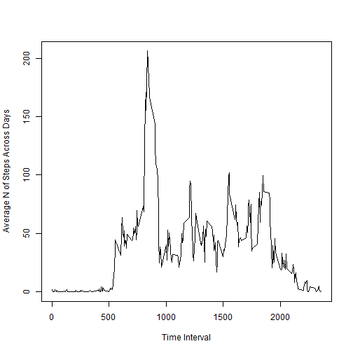
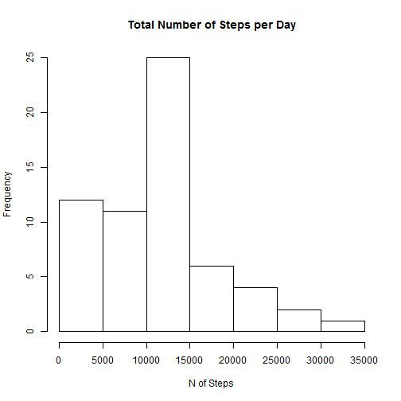

## Loading and preprocessing the data

```r
act <- read.csv('activity.csv', header = T, sep = ',')
	# Read data in.

dtime <- as.POSIXlt(act$d)
	# Convert date into POSIXlt class.

act$weekday <- weekdays(dtime)
	# Save date as weekday in data frame.
act$wdayn <- dtime$wday
	# Save date as weekday NUMBER in data frame.
```


## What is mean total number of steps taken per day?

```r
act_bu <- act
	# Backing up the original dataset for convenience. 
act <- act[complete.cases(act),]
tapply(act$steps, act$wdayn, mean)
```

```
##        0        1        2        3        4        5        6 
## 42.63095 34.63492 31.07485 40.94010 28.51649 42.91567 43.52579
```


## What is the average daily activity pattern?


```r
actint <- aggregate(act[, c('steps')], list(interv = act[,'interval']), mean)

plot(x~interv, data = actint, type = 'l', 
	xlab = 'Time Interval', ylab = 'Average N of Steps Across Week Days')
```

 

## Imputing missing values


```r
na_rows <- apply(act_bu, 1, function (x) sum(is.na(x)) )
na_cols <- apply(act_bu, 2, function (x) sum(is.na(x)) )
```
With the following call I assess whether there are rows that
have more than one missing value. 


```r
sum(!na_rows %in% 0:1)
```

```
## [1] 0
```
With this line I assert that only the steps variable has missing values. 

```r
head(na_cols)
```

```
##    steps     date interval  weekday    wdayn 
##     2304        0        0        0        0
```
This is the number of missing values.

```r
na_cols['steps']
```

```
## steps 
##  2304
```
Get interval Means


```r
act <- act_bu[complete.cases(act_bu),]

interval_means <- by(act[, c('interval', 'steps')], act[, 'interval'], function(x) mean(x[, 'steps']))
```


In place replacements only with FOR LOOPS!! See [Advanced R](http://adv-r.had.co.nz/Functionals.html#functionals-not) for details. 

```r
act2 <- act_bu
for (i in 1:nrow(act2) ){
	if (is.na(act2[i, 'steps'])){
		xint <- as.character( act2[i, 'interval'] )
		act2[i, 'steps'] <- interval_means[xint]
			}
	}
```

## Are there differences in activity patterns between weekdays and weekends?

```r
library(lattice)

act2$pweek <- ifelse(act2$weekday %in% c('Saturday', 'Sunday'), 
			'weekend', 'weekday')
	# I create a new variable, with part of week (whether a particular day is weekday
	# or weekend).

act2int <- aggregate(steps ~ interval + pweek, data = act2, mean)
	# Averaging number of steps, across interval and parts of week

xyplot(steps ~ interval|pweek, act2int, layout = c(1, 2), type = 'l',
	ylab = 'Number of Steps', xlab = 'Interval')
```

 

```r
	# Plotting lines with average n of steps, for weekdays and weekends.
```

