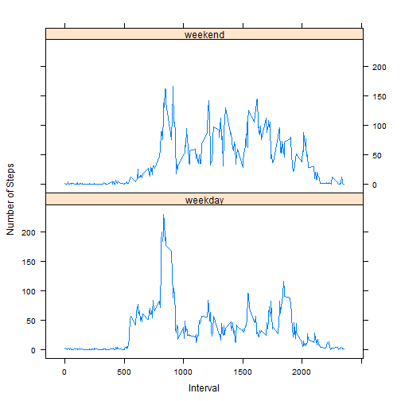

## Loading and preprocessing the data

```r
act <- read.csv('activity.csv', header = T, sep = ',')
	# Read data in.

dtime <- as.POSIXlt(act$d)
	# Convert date into POSIXlt class.

act$weekday <- weekdays(dtime)
	# Save date as weekday in data frame.
act$wdayn <- dtime$wday
	# Save date as weekday NUMBER in data frame.
	
actls <- split(act, act$date)
	# A list of data frame, one for each date. 
acttot <- lapply(actls, function(x) { 
	data.frame(steps = sum(x$steps),
			date = x[[2]][1],
			weekday = x$weekday[1],
				wdayn = x$wdayn[1])
	})
acttot <- Reduce(rbind, acttot)
	# Creating a data frame with total steps for each date.
acttot_bu <- acttot
	# And backing it up.
```


## What is mean total number of steps taken per day?

```r
acttot <- acttot_bu[complete.cases(acttot_bu), ]
	# Retaining only complete cases (some dates are empty!).
hist(acttot$steps, main = 'Total Number of Steps per Day', xlab = 'N of Steps')
```

 

```r
	# Plotting total n of steps per day. 
step_mean <- mean(acttot$steps)
step_med <- quantile(acttot$steps, 0.5)
```
The **mean** total number of steps across all dates is 1.0766189 &times; 10<sup>4</sup>
and the **median** 1.0765 &times; 10<sup>4</sup>.


## What is the average daily activity pattern?


```r
act_bu <- act
	# Backing up orginal data set for convenience.
act <- act[complete.cases(act), ]
	# Keeping only rows with non-missing values.
actint <- aggregate(act[, c('steps')], list(interv = act[,'interval']), mean)
	# Averaging n of steps across dates.
plot(x~interv, data = actint, type = 'l', 
	xlab = 'Time Interval', ylab = 'Average N of Steps Across Days')
```

 

```r
max_int <- actint[which(actint$x == max(actint$x)), 'interv']
```

The time interval with the **maximum** number of steps, across all dates is 835.


## Imputing missing values


```r
na_rows <- apply(act_bu, 1, function (x) sum(is.na(x)) )
na_cols <- apply(act_bu, 2, function (x) sum(is.na(x)) )
```
With the following call I assess whether there are rows that
have more than one missing value. 


```r
sum(!na_rows %in% 0:1)
```

```
## [1] 0
```
With this line I assert that only the steps variable has missing values. 

```r
head(na_cols)
```

```
##    steps     date interval  weekday    wdayn 
##     2304        0        0        0        0
```
This is the number of missing values.

```r
na_cols['steps']
```

```
## steps 
##  2304
```
Get **interval** Means, to replace missing values.


```r
act <- act_bu[complete.cases(act_bu),]

interval_means <- by(act[, c('interval', 'steps')], act[, 'interval'], function(x) mean(x[, 'steps']))
```


In place replacements only with FOR LOOPS!! See [Advanced R](http://adv-r.had.co.nz/Functionals.html#functionals-not) for details. 

```r
act2 <- act_bu
	# Restoring the original data set with the missing values. 
for (i in 1:nrow(act2) ){
	if (is.na(act2[i, 'steps'])){
		xint <- as.character( act2[i, 'interval'] )
		act2[i, 'steps'] <- interval_means[xint]
			}
	}

actls <- split(act2, act$date)
```

```
## Warning in split.default(x = seq_len(nrow(x)), f = f, drop = drop, ...):
## data length is not a multiple of split variable
```

```r
acttot <- lapply(actls, function(x) { 
	data.frame(steps = sum(x$steps),
			date = x[[2]][1],
			weekday = x$weekday[1],
				wdayn = x$wdayn[1])
	})
acttot <- Reduce(rbind, acttot)
	# Creating a data frame with total steps for each date.
acttot_bu <- acttot
	# And backing it up.
```
Here is a histogram of the total number of steps after imputting missing values.

```r
hist(acttot$steps, main = 'Total Number of Steps per Day', xlab = 'N of Steps')
```

 

```r
	# Plotting total n of steps per day. 
step_mean <- mean(acttot$steps)
step_med <- quantile(acttot$steps, 0.5)
```
The **mean** total number of steps across all dates is 1.0766189 &times; 10<sup>4</sup>
and the **median** 1.06 &times; 10<sup>4</sup>.

Due to the majority of values been zero, imputing the mean as a replacement for NA's, 
increases the frequency of lower values. This is so because the means are affected (specifically 
attenuated) by extreme values in the lower end. One can assert that the majority of values is zero
thusly:

```r
mean(act_bu$steps == 0, na.rm = T)*100
```

```
## [1] 72.15671
```

```r
	# This gives the percentage of TRUE values. 
```


## Are there differences in activity patterns between weekdays and weekends?

```r
library(lattice)

act2$pweek <- ifelse(act2$weekday %in% c('Saturday', 'Sunday'), 
			'weekend', 'weekday')
	# I create a new variable, with part of week (whether a particular day is weekday
	# or weekend).

act2int <- aggregate(steps ~ interval + pweek, data = act2, mean)
	# Averaging number of steps, across interval and parts of week

xyplot(steps ~ interval|pweek, act2int, layout = c(1, 2), type = 'l',
	ylab = 'Number of Steps', xlab = 'Interval')
```

 

```r
	# Plotting lines with average n of steps, for weekdays and weekends.
```

